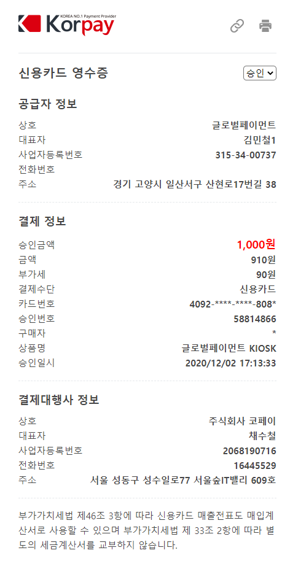

# 거래영수증

코페이에서 결제된 영수증을 볼 수 있는 주소를 제공합니다.

- 요청주소 : https://pgapi.korpay.com/api/receipt <Green>`GET`</Green>

## 파라미터 정보

### 요청 파라미터

---
**tid** <Green>**String**</Green> <Yellow>**Unique**</Yellow> <Gray>`30byte`</Gray> <br/>
거래고유번호 (ex : ktest5561m01032012021713340481)

## 영수증 요청 예시

영수증 요청 예시

```shell title="요청예시"
curl --request GET \
  --url https://pgapi.korpay.com/api/receipt?tid=ktest5561m01032012021713340481 \
```
영수증 화면 예시

<Center>



</Center>


export const Green = ({children}) => (
<span
style={{
color:"#00A661"
}}>
{children}
</span>
);

export const Gray = ({children}) => (
<span
style={{
color:"#898989"
}}>
{children}
</span>
);

export const Yellow = ({children}) => (
<span
style={{
color:"rgb(255, 196, 38)"
}}>
{children}
</span>
);

export const Center = ({children}) => (
<div class="centered-image">{children}</div>
);
